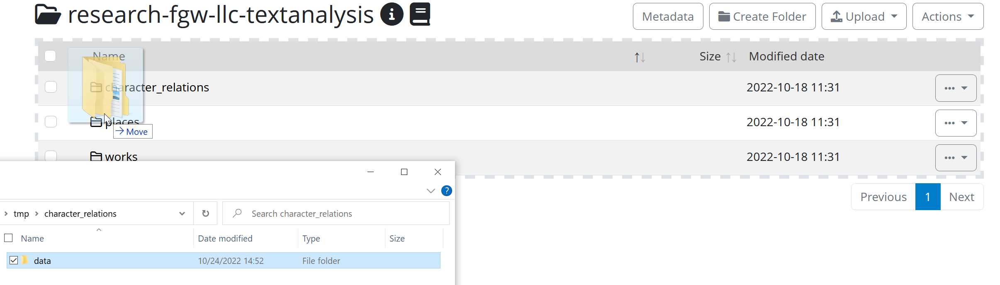

# Getting started with the Yoda Portal

## Invitation to Yoda collaboration
After you are added to a Yoda group by the admin or a colleague you will receive an invitation to join a Yoda "collaboration" in SRAM ([SURF Research Access Management](https://www.surf.nl/en/services/surf-research-access-management)). The "join" link in the invitation will lead you to SRAM. 

- If you have not logged in to SRAM before with your browser you will see the following screen where you can search for your institute:

- Click on the name to be redirected to your familiar institutional login page.

- If your institute is not in this list or if you are not affiliated with a research or education organisation please choose **eduID (NL)**. If you do not yet have an eduID you can create one for free, the system will lead you through the process. More information on eduID here: https://www.eduid.nl/

- When logged in you will be shown a welcome screen in SRAM, click proceed to accept the invitation. 
- Now click the "Open" button to go to the Yoda portal. 

## Logging in to the Yoda portal.
Go to [https://portal.yoda.vu.nl/](https://portal.yoda.vu.nl/)

Log in using the "Sign in" button. You will be prompted for your email address. Your user name is your primary email address (in lowercase) from your institution or the email address associated with your eduID.. 

Click Next. You will be forwarded to the familiar login page of your institute or eduID.

VU users: note that instead of the TiQR app you should now use the 
more user-friendly Azure MFA. Switch by following [this instruction manual](https://vunl.sharepoint.com/:f:/r/sites/Collaboration-Services/Identity%20and%20security/Tiqr%20-%20MFA%20Manuals?csf=1&web=1&e=KhnHHc) 
on the VU SharePoint.

**VU Students** might need to visit the Service Desk to enable MFA via SURFsecureID for their student.vu.nl account if they have not done so before. The procedure is explained in [this document on the VU services portal](https://services.vu.nl/kb_view.do?sysparm_article=KB0011809).

## Overview of the Yoda Portal
### Group Manager
Yoda allows you to store your valuable research data in a secure way.  The data is kept in data compartments,
which can only be accessed by members.

The Group Manager can be used to view a list of data compartments and their members. People with a "group manager" role
can add members to a data compartment, remove them, and change their roles.

See: [Managing groups, users and access rights](user-management.html)

### Your data in the Yoda Portal
Each group in Yoda has two main folders:

#### Research
The main folder ("research-...") contains current research data that researchers
collaborate on. Data is kept in subfolders. The subfolders can be organized according
to the needs of the researcher.

You can also drag-and-drop files to your research folder.

#### Archiving
After completion of a study, the data in that subfolder can be deposited so that it is
kept for 10 years or longer. Use the "Submit" button to deposit the subfolder. This will
copy the contents of the subfolder to the Vault folder as a new data package.
Before doing so, the subfolder must be described with metadata, which can be entered by
clicking on the Metadata button. 

For more information on metadata in Yoda see: [Metadata in Yoda](metadata-add.md).

#### Vault
The folder named "vault-..." contains deposited data packages.
Once deposited, data cannot be removed. Therefore the vault can be used to account for data
in a research project to comply with FAIR principles.

#### Publishing
Researchers can opt to (but do not have to) publish any of the vault deposited data packages
to make the metadata description of a data package known to the research community at large.
Yoda adds a DOI persistent identifier to published data so that the data package can be cited
and found in catalogs such as Datacite, Narcis, B2Find etcetera.
If (and only if) the data has been classified as "open" then the content itself can be downloaded
by anyone from the internet. Otherwise, only the metadata description can be viewed.
